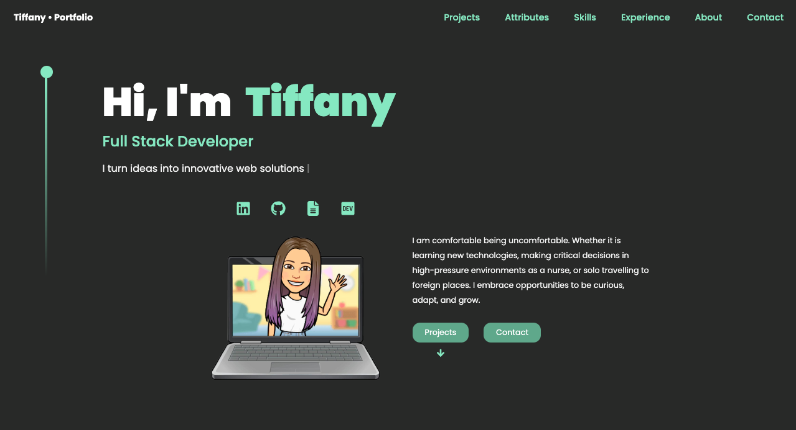

# Hi, I'm Tiffany 👋  

<!--
**t-iffany/t-iffany** is a ✨ _special_ ✨ repository because its `README.md` (this file) appears on your GitHub profile.

https://docs.github.com/en/get-started/writing-on-github/getting-started-with-writing-and-formatting-on-github/quickstart-for-writing-on-github

<picture>
 <source media="(prefers-color-scheme: dark)" srcset="YOUR-DARKMODE-IMAGE">
 <source media="(prefers-color-scheme: light)" srcset="YOUR-LIGHTMODE-IMAGE">
 
</picture>

Here are some ideas to get you started:

- 🔭 I’m currently working on ...
- 🌱 I’m currently learning ...
- 👯 I’m looking to collaborate on ...
- 🤔 I’m looking for help with ...
- 💬 Ask me about ...
- 📫 How to reach me: ...
- 😄 Pronouns: ...
- ⚡ Fun fact: ...
-->

<a href="https://tiffanyleong.vercel.app/" target="_blank">My Portfolio Site</a> || <a href="https://www.linkedin.com/in/tiffanyleong/" target="_blank">LinkedIn</a> || <a href="https://devpost.com/t-iffany" target="_blank">Devpost</a> || <a href="https://resume.creddle.io/resume/fg0759bs3gt" target="_blank">Resume</a>
 

Full Stack Developer experienced in systems implementations, informatics, and public health. 

 

# 👩🏻‍💻 Projects:

<!--  -->

# 📈 Stats:

   
    

 

 # 💻 Technologies:

<!-- 

My Top Tech Stacks

|           |
|-----------|
| JavaScript|
| React     |
| Node.js   |
| SQL       |
| Ruby      |
| HTML      |
| CSS       |

 -->

<table>  
  <tr>
    <td align="left" width="10">Languages</td>
  </tr>
  <tr>
    <td align="center" height="20" width="10">
      
       <strong>HTML</strong>
    </td>
    <td align="center" height="20" width="10">
      
       <strong>CSS</strong>
    </td>
    <td align="center" height="20" width="10">
      
       <strong>JavaScript</strong>
    </td>
    <td align="center" height="20" width="20">
      
       <strong>Ruby</strong>
    </td>
    <td align="center" height="20" width="20">
      
       <strong>SQL</strong>
    </td>
  </tr>

  <tr>
    <td align="left" width="10">Frameworks</td>
  </tr>
  <tr>
    <td align="center" height="20" width="20">
      
       <strong>NodeJS</strong>
    </td>
    <td align="center" height="20" width="20">
      
       <strong>Express</strong>
    </td>
    <td align="center" height="20" width="20">
      
       <strong>Rails</strong>
    </td>
    <td align="center" height="20" width="20">
      
       <strong>React</strong>
    </td>
    <!-- <td align="center" height="20" width="20">
      
       <strong>jQuery</strong>
    </td> -->
    <td align="center" height="20" width="20">
      
       <strong>EJS</strong>
    </td>
  </tr>

  <tr>
    <td align="left" width="10">Databases</td>
  </tr>
  <tr>
    <td align="center" height="20" width="20">
        
         <strong>PostgreSQL</strong>
      </td>
      <td align="center" height="20" width="20">
        
         <strong>mySQL</strong>
      </td>     
  </tr>

  <tr>
    <td align="left" width="10">Testing</td>
  </tr>
  <tr>
    <td align="center" height="20" width="20">
      
       <strong>Cypress</strong>
    </td>
    <td align="center" height="20" width="20">
      
       <strong>Storybook</strong>
    </td>
    <td align="center" height="20" width="20">
      
       <strong>Jest</strong>
    </td>
    <td align="center" height="20" width="20">
      
       <strong>Mocha</strong>
    </td>
    <td align="center" height="20" width="20">
      
       <strong>Chai</strong>
    </td>
    <td align="center" height="20" width="20">
      
       <strong>RSpec</strong>
    </td>
  </tr>  
  <tr>
  

  <tr>
    <td align="left" width="10">Tools</td>
  </tr>
  <tr>
    <td align="center" height="20" width="20">
      
       <strong>Jira</strong>
    </td>
    <td align="center" height="20" width="20">
      
       <strong>Confluence</strong>
    </td>
    <td align="center" height="20" width="20">
      
       <strong>Slack</strong>
    </td>
    <td align="center" height="20" width="20">
      
       <strong>Visio</strong>
    </td>