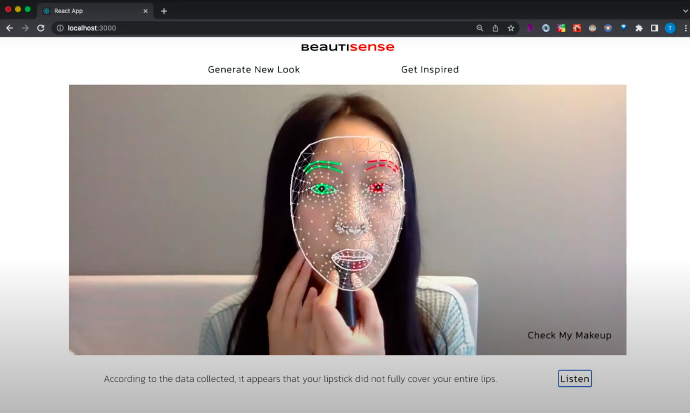

# Hi, I'm Tiffany 👋  
<a href="https://tiffanyleong.vercel.app/" target="_blank">My Portfolio Site</a>  |  <a href="https://www.linkedin.com/in/tiffanyleong/" target="_blank">LinkedIn</a>  |  <a href="https://devpost.com/t-iffany" target="_blank">Devpost</a>  |  <a href="https://resume.creddle.io/resume/fg0759bs3gt" target="_blank">Resume</a>
 

<h3>
Full Stack Developer experienced in systems implementations, informatics, and public health.   
</h3>
💡&nbsp;&nbsp;  I turn ideas into innovative web solutions   
⚡️&nbsp;&nbsp;  I’m seeking <strong>developer/software engineer roles</strong>   
🌱&nbsp;&nbsp;  I’m currently learning <strong>Python</strong>, <strong>React Native</strong>, and building a food delivery app clone   
📧&nbsp;&nbsp;  Let's chat about interesting <strong>opportunities</strong> or <strong>collabs</strong>!

  

# 👩🏻‍💻 Projects:

<table>

<!-- 1st row -->
  <tr>
    <td width="50%" valign="top">
      <h3 align="center">My Portfolio</h3>
       
      
       
      

        <a href="https://tiffanyleong.vercel.app/" target="_blank">Link</a>  
        <strong>Javascript | Vite | TailwindCSS | HTML</strong>    
        Check out my personal portfolio site!
      

    </td>
    <td width="50%" valign="top">
      <h3 align="center">ZenZone 3D</h3>
       
      
       
      

        <a href="https://github.com/t-iffany/cmdf-2023" target="_blank">Repo</a>  
        <strong>React | Typescript | CSS | HTML | NodeJS | ExpressJS | Spline | Cohere.ai API | Twilio API</strong>    
       •  🏆  2nd Place Winner + Most Creative Use of Twilio Award + Best Use of Cohere API Award (nWPlus Cmd-f Hackathon)  
       •  Interactive 3D game that promotes mental wellness using AI technology
      

    </td>
  </tr>
  
<!-- 2nd row -->
  <tr>
    <td width="50%" valign="top">
      <h3 align="center">BinIt!</h3>
       
      
       
      

        <a href="https://github.com/t-iffany/roothacks-project" target="_blank">Repo</a>  
        <strong>React | Javascript | CSS | HTML | Python | Flask</strong>    
        •  🏆  Winner of Best Project With At Least One Women-Identifying or Non-Binary Member on the Team (RootHacks Hackathon) 
        •  A full stack application that uses AI to sort waste based on images using computer vision and machine learning algorithms
      

    </td>
    <td width="50%" valign="top">
      <h3 align="center">PawHub</h3>
       
      
       
      

        <a href="https://github.com/t-iffany/pawhub" target="_blank">Repo</a>  
        <strong>Javascript | React | Ruby on Rails | PostgreSQL | Bootstrap | Material UI | Axios | Google Maps API | YouTube API</strong>    
        •  A full stack application for pet owners to connect with other pet owners, find local pet resources, and learn about different breeds and pet care.  
        •  Features: discussion board, explore page, map page, breed information page, video page
      

    </td>
  </tr>
  
  
<!-- 3rd row -->
  <tr>
    <td width="50%" valign="top">
      <h3 align="center">On The Run</h3>
       
      
       
      

        <a href="https://devpost.com/software/multiverse-chase" target="_blank">Devpost</a>  
        <strong>Python | Pygame</strong>    
        •   A side-scrolling platform game with a multiverse heist theme. Players collect items while being chased, and navigate obstacles to reach the next levels. 
        •  Submission for Pygames Hackathon hosted by Microsoft
      

    </td>
    <td width="50%" valign="top">
      <h3 align="center">BeautiSense</h3>
       
      
       
      

        <a href="https://devpost.com/software/beautisense" target="_blank">Devpost</a>  
        <strong>Python | OpenCV | Javascript</strong>    
        •  Idea Track Submission for ELC Accessible Beauty Hackathon 
        •  An application that uses AI, facial recognition, and computer vision to provide personalized makeup guidance and accessibility features
      

    </td>
  </tr>
  
  
</table> 

# 📈 Stats:

   
    

  

 # 💻 Technologies:

<table>  
  <tr>
    <td align="left" width="10">Languages</td>
  </tr>
  <tr>
    <td align="center" height="20" width="10">
      
       <strong>HTML</strong>
    </td>
    <td align="center" height="20" width="10">
      
       <strong>CSS</strong>
    </td>
    <td align="center" height="20" width="10">
      
       <strong>JavaScript</strong>
    </td>
    <td align="center" height="20" width="20">
      
       <strong>Ruby</strong>
    </td>
    <td align="center" height="20" width="20">
      
       <strong>SQL</strong>
    </td>
  </tr>

  <tr>
    <td align="left" width="10">Frameworks</td>
  </tr>
  <tr>
    <td align="center" height="20" width="20">
      
       <strong>NodeJS</strong>
    </td>
    <td align="center" height="20" width="20">
      
       <strong>Express</strong>
    </td>
    <td align="center" height="20" width="20">
      
       <strong>Rails</strong>
    </td>
    <td align="center" height="20" width="20">
      
       <strong>React</strong>
    </td>
    <!-- <td align="center" height="20" width="20">
      
       <strong>jQuery</strong>
    </td> -->
    <td align="center" height="20" width="20">
      
       <strong>EJS</strong>
    </td>
  </tr>

  <tr>
    <td align="left" width="10">Databases</td>
  </tr>
  <tr>
    <td align="center" height="20" width="20">
        
         <strong>PostgreSQL</strong>
      </td>
      <td align="center" height="20" width="20">
        
         <strong>mySQL</strong>
      </td>     
  </tr>

  <tr>
    <td align="left" width="10">Testing</td>
  </tr>
  <tr>
    <td align="center" height="20" width="20">
      
       <strong>Cypress</strong>
    </td>
    <td align="center" height="20" width="20">
      
       <strong>Storybook</strong>
    </td>
    <td align="center" height="20" width="20">
      
       <strong>Jest</strong>
    </td>
    <td align="center" height="20" width="20">
      
       <strong>Mocha</strong>
    </td>
    <td align="center" height="20" width="20">
      
       <strong>Chai</strong>
    </td>
    <td align="center" height="20" width="20">
      
       <strong>RSpec</strong>
    </td>
  </tr>  
  <tr>
  

  <tr>
    <td align="left" width="10">Tools</td>
  </tr>
  <tr>
    <td align="center" height="20" width="20">
      
       <strong>Jira</strong>
    </td>
    <td align="center" height="20" width="20">
      
       <strong>Confluence</strong>
    </td>
    <td align="center" height="20" width="20">
      
       <strong>Slack</strong>
    </td>
    <td align="center" height="20" width="20">
      
       <strong>Visio</strong>
    </td>